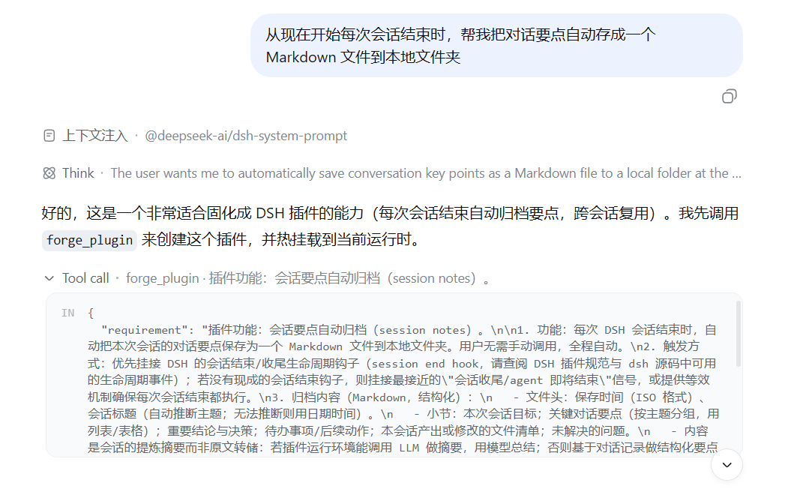

# dsh-plugin-forge

[](https://github.com/csiroqa/dsh-plugin-forge/actions/workflows/ci.yml)

An AI-native DSH plugin generator. The AI calls `forge_plugin` while executing tasks: a subagent builds the plugin → it is migrated to an independent git repo under `project-root/dsh-plugins/<name>` (English Conventional Commit on feature completion) → hot-mounted into the current session.

中文: [README.md](README.md)

## Tool `forge_plugin`

| Param | Type | Default | Description |
| --- | --- | --- | --- |
| `requirement` | string | required | Plugin requirement (Chinese preferred) |
| `name` | string | auto | Repo dir name (kebab-case, derived from requirement) |
| `targetRoot` | string | project-root/dsh-plugins | Migration root (arg > config > default) |
| `migrate` | boolean | `true` | Migrate to an independent repo and commit |
| `update` | boolean | `false` | Update an existing repo (guards overwrites) |
| `install` | boolean | auto by default | Install into profile: auto-detects the current profile by default; `false` disables; `installProfile` overrides |
| `hot` | boolean | `true` | Hot-mount into the current runtime |

Output JSON:

| Field | Description |
| --- | --- |
| `ok` `pluginName` `committed` `build` `files` | Required; `build` = `passed` / `skipped` / failure reason |
| `migratedTo` | Absolute repo path (forward slashes); absent when `migrate=false` |
| `commitSubject` | Commit subject; absent when nothing committed |
| `childReport` | Subagent REPORT notes (truncated to 500 chars) |
| `installed` `installDetail` `hotMounted` `hotDetail` | Profile install (`installDetail` explains when `installed=false`) / hot-mount result; neither failure blocks delivery |
| `duplicated` `existingName` | Subagent judged the requirement a duplicate: no new repo, existing name returned |

Failure (subagent not completed / post-migration build failed / load smoke failed) throws; staging is kept.

## Commands `/forge status` and `/forge stats`

`/forge status` (same as bare `/forge`) prints per repo; the trailing segment is that plugin's tool call summary:

```
- <name>（<path>）
  HEAD：<short-hash> <subject>；worktree：clean|dirty|missing；last commit：<local time>，count <n>；calls <c>（ok <ok> / failed <failed>，<t> tools），last <local time>
```

With no records the segment reads "尚无调用记录"; an empty registry prints "plugin-forge 尚未创建任何插件仓库。"

`/forge stats [plugin]` prints the per-tool table (plugin / tool / calls / ok / failed / last call, sorted by call count); `/forge stats reset [plugin]` clears the ledger (all of it when the plugin name is omitted).

## Tool call ledger

- File: `$DSH_HOME/storages/plugin-call-stats.json` (default `~/.dsh/storages/`), shape `{version: 1, plugins: {<plugin>: {tools: {<tool>: {calls, ok, failed, lastCalledAt, lastOkAt?, lastFailedAt?, lastError?}}, firstSeenAt, updatedAt}}}`
- **New plugins get it automatically**: the subagent prompt mandates a `src/call-stats.ts` inlining the standard module shipped by `plugin-call-stats.template.ts`, and every tool `execute` is wrapped with `withCallStats('<plugin>', '<tool>', execute)`. Plugin repos are independent, so the module is inlined rather than shared; `src/call-stats.spec.ts` guards the two sides against drift
- plugin-forge's own `forge_plugin` records through the same interface (plugin name `plugin-forge`)
- Side-channel guarantees: only plugin/tool names, outcome and timestamps are stored (never arguments or results), deltas are merged and written atomically (tmp → rename), and every failure is swallowed so a tool never breaks on accounting

## Pipeline

staging → subagent develops (typecheck/test/build) → duplicate check → migrate → rebuild in target → load smoke → git init/commit → register → profile install (auto by default) → hot-mount.

- staging: `<stagingRoot>/<name>`, default `workspace/.forge-staging/<name>`; the subagent may only write here
- Same-name runs are mutexed in-process; stale staging cleaned up before a run when `stagingTtlDays > 0`
- Migration: `deepseek-harness` paths in link deps and CI rewritten to target depth, registry-versioned `@deepseek-ai/*` deps rejected, `.gitignore` written (excludes node_modules/.git/.pnpm-store/lib/dist)
- Update mode additionally runs `syncRemoveStale`: deletes source files in the target no longer present in staging
- Commit: `<type>: <name>[: <summaryEn>]`, header ≤ 72 chars, summary clipped to budget; invalid type falls back to `feat`
- Registration: `$DSH_HOME/plugin-forge.json`, shape `{version: 1, repos: [{name, path, createdAt, lastCommitAt?, commitCount, summaryZh?}]}`, atomic tmp+rename write
- Push only when explicitly configured (off by default, per AGENTS.md)

## Avoiding duplicates

The guidance section does not inject a plugin list (saves context). The subagent self-checks before developing: it reads the registry and the `dsh-plugins/` directory; a duplicate requirement is reported as `duplicate_of` → the host refuses to create a new repo and returns `duplicated: true` + `existingName`; iterate with `update=true`.

## Config (cordis.patch.yml)

| Key | Default | Description |
| --- | --- | --- |
| `targetRoot` | `''` | Migration root; empty = workspace parent/dsh-plugins |
| `stagingRoot` | `''` | Staging root; empty = workspace/.forge-staging |
| `harnessRoot` | `''` | deepseek-harness checkout root; empty = auto-discovered |
| `subagentProvider` | `spawn` | Subagent provider |
| `maxChildDepth` | `2` | Subagent delegation depth cap (1–5) |
| `childTimeoutMs` | `2700000` | Subagent/build timeout (≥ 60000) |
| `commitType` | `feat` | Conventional Commit type |
| `push` | `false` | Push after commit |
| `gitAuthorName` | `csiroqa` | Commit author name |
| `gitAuthorEmail` | `justinwangyj@163.com` | Commit author email |
| `keepStaging` | `true` | Keep staging for debugging |
| `stagingTtlDays` | `0` | Staging retention days; 0 = never clean |
| `installProfile` | `''` | Profile installed into; empty = auto-detect the current profile |
| `autoInstall` | `true` | Auto-install into the current profile on success (`install: false` disables one call) |

## Quality gates

typecheck/test/build in staging → `pnpm install && pnpm build` in the target after migration → main/types existence check → reject registry-versioned `@deepseek-ai/*` deps → **load smoke** (run `apply` on a real cordis Context; catches apply-time crashes — real incident: an empty command `input.hint` crashed DSH at boot) → **host tool-name conflict guard** (confirmed mechanism: dsh-tools allows cross-scope same-name registration without error, but the model-side view shadows; enforced at both load smoke and hot-mount) → diff checked before commit.

## Install

```sh
pnpm install && pnpm build
dsh plugin --profile web add link:D:\2-OGP\dsh-plugin-forge
```

Restart `dsh web`. Prerequisites: Node ≥ 22, pnpm, a local `deepseek-harness` checkout (deps are `link:`ed to `../deepseek-harness`).

## Delivery methods

1. Hot-mount (default): mounted into the current runtime after generation, usable this session
2. Profile install (auto by default): current profile auto-detected (`installProfile` overrides), effective after restart
3. repository source (home-level plugin-console): `repository-plugins.repositories` in `$DSH_HOME/cordis.patch.yml`, managed as panel lines — add = install, update = lock to the latest remote commit, delete = uninstall, edits take effect immediately; line format `github:owner/repo#ref` (`&path:/packages/<subpkg>` for monorepos). Forge products are single-package independent repos — push to GitHub and add directly as a source; later `update=true` iterations are picked up by the panel's update

## Real-LLM testing (no GUI restart)

```sh
node scripts/llm-e2e-host.mjs prompt <name> <stagingDir> <targetRoot> <harnessRoot> "<requirement>"
node scripts/llm-e2e-host.mjs run <name> <stagingDir> <targetRoot> <harnessRoot> "feat: <name>: <summary>"
```

`prompt`: generates the real subagent prompt; `run`: executes the host-side pipeline (migration/link+CI rewrite/build/commit/register); `--update` exercises the update path.

## Security

- forge spawns subagents, runs networked `pnpm install`, builds in the target, and executes `git commit` — only pass requirements you trust
- Diff checked before commit, `.gitignore` excludes build artifacts and deps, no automatic push/tag/release
- The subagent may only write inside staging (within the workspace)

## Demo

Session captures of the agent spontaneously requesting a plugin:




